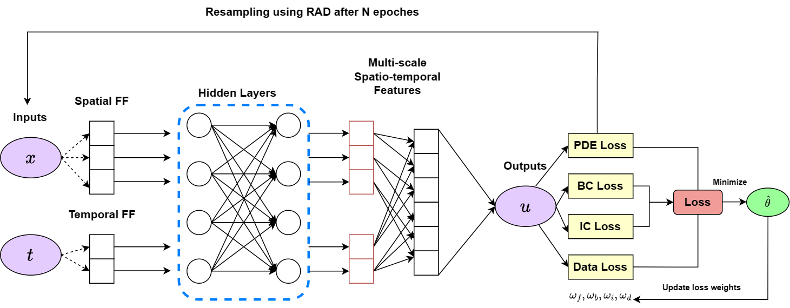
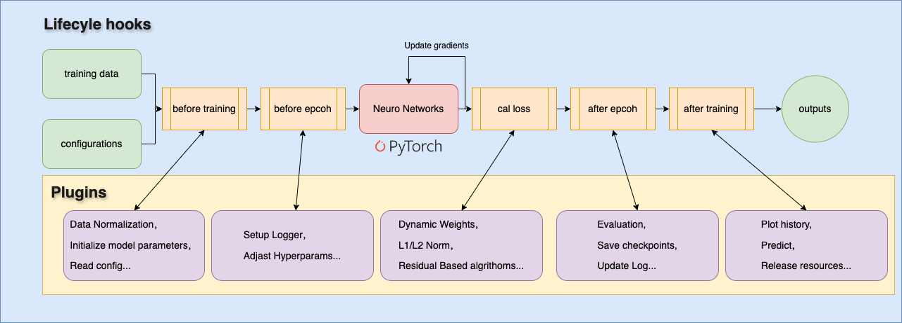

# MS-PINN: Physics-Informed Neural Networks for Modeling Multi-field Coupled Evolution in Metal Solidification

## 1. Overview



Figure 1: The overall architecture of MS-PINN. The input spatial position $\mathbf{x}$ and time $t$ are first transformed into high-dimensional features through FFE, enhancing the network's ability to capture high-frequency physical features. After processing through multiple neural network layers, the model outputs the predicted physical state $\mathbf{u}$. Automatic differentiation computes the physical constraint losses, including PDE residuals, boundary condition, and initial condition losses, ensuring that the training adheres to physical laws. SAL and RAD strategies jointly optimize the model's prediction accuracy and learning efficiency in key areas, achieving high-precision simulation of the metal solidification process.



Figure 2: Architecture of the general PDE solving software based on PINN. The architecture demonstrates the integration of a plugin system which enhances flexibility and scalability by allowing user-defined callbacks at various stages of the training process.

## 2. Installation

```
... install pytorch
>>> pip install fastapi tqdm rich matplotlib numpy pandas imageio
```

## 3. File structure

```
NeuroPDE/
    api.py         Provides backend API services based on FastAPI
    data/          Contains data files and scripts for generating data files
    logs/          Stores training logs and checkpoint file paths
    utils/         Utility functions such as CSV handling and metrics calculation
    visualize/     Tools for plotting graphs
    config/
        common.py  Configuration settings for NeuroPDE, allowing customization of the training process
    train/
        pinn.py
        callback.py  Lifecycle hook class, can be extended to create custom plugins
        modules/     Built-in modules, including checkpoints, plotting, logging, and various algorithms
    pdes/
        gradients   Utility functions for calculating gradients
    models/        Built-in network architectures, with the option to create custom networks

```

## 4. Training for MS-PINN(Modeling Multi-field Coupled Evolution in Metal Solidification)

```
python ./MS-PINN/train_MS_PINN.py
```

## 5. NeuroPDE VS DeepXDE

```
python ./MS-PINN/train_burgers_dde.py
python ./MS-PINN/train_burgers.py

python ./MS-PINN/train_diffusion_dde.py
python ./MS-PINN/train_diffusion.py

python ./MS-PINN/train_ns_dde.py
python ./MS-PINN/train_ns_inverse.py
```

## 6. Acknowledgements

This work was sponsored by the National Key Research and Development Program of China (No. 2023YFB4606200), Key Program of Science and Technology of Yunnan Province (No. 202302AB080020), and Key Project of Shanghai Zhangjiang National Independent Innovation Demonstration Zone (No. ZJ2021-ZD-006). The authors gratefully appreciate the anonymous reviewers for their valuable comments.
